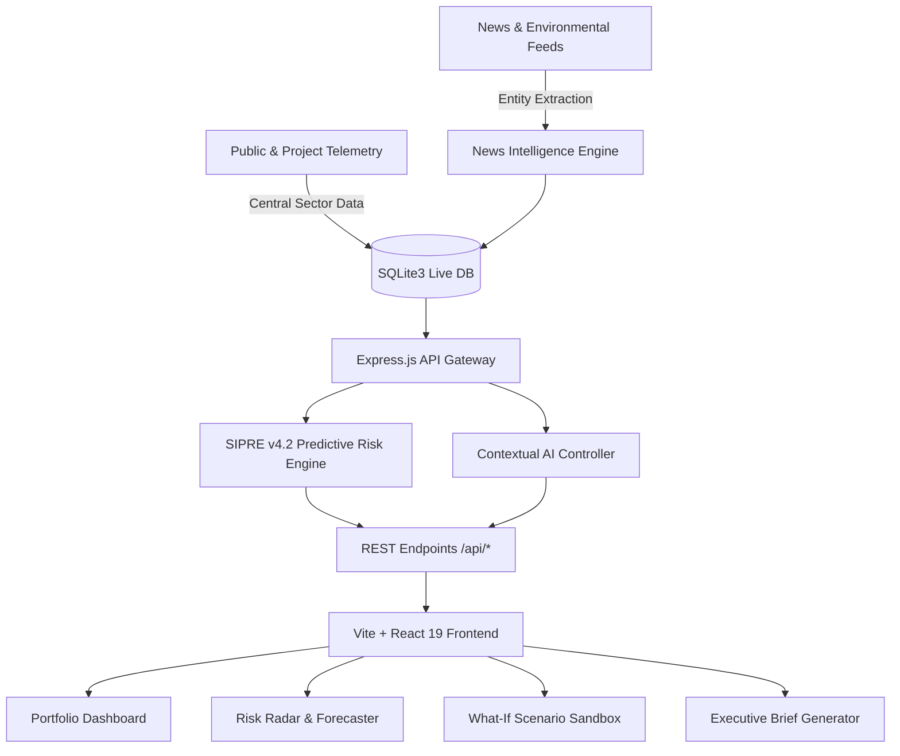

<div align="center">

# InfraSentinel (Project Sentinel)
### **AI-Powered Infrastructure Project Early-Warning & Decision Support System**

[](https://react.dev/)
[](https://vitejs.dev/)
[](https://tailwindcss.com/)
[](https://nodejs.org/)
[](https://www.sqlite.org/)
[](LICENSE)

*Built to safeguard national megaprojects under PM GatiShakti, MoSPI, and PRAGATI frameworks.*

</div>

---

## Executive Summary

India commits hundreds of billions of dollars annually to central sector infrastructure—high-speed rail corridors, expressways, hydroelectric dams, and deepwater ports. However, traditional project monitoring has historically been retrospective—discovering delays and cost escalations only after public funds have evaporated.

**InfraSentinel (Project Sentinel)** is an end-to-end, predictive decision-support platform designed to transform infrastructure governance from reactive audit into proactive prevention. Powered by the **SIPRE v4.2 Predictive Risk Engine**, it identifies hidden execution friction, tracks capital burn-rate divergence, correlates external supply-chain shocks, and allows policymakers to simulate strategic interventions before committing capital.

---

## Key Modules and Capabilities

### 1. Executive Portfolio Command Center
- **Live MoSPI Telemetry**: Real-time monitoring of Central Sector projects with aggregate metrics.
- **Exposure Quantification**: Tracks over Rs 3,12,000+ Cr in active cost escalations across sectors.
- **Triage Categorization**: Automatic classification into Critical, High, Moderate, and Low risk cohorts.

### 2. Risk Radar (`/risk-radar`)
- Multi-dimensional sorting and filtering across ministries (Railways, Power, Road Transport & Highways, Petroleum).
- Search by project code, implementing agency, or geography.
- Direct drill-down to forensic project-level audits.

### 3. SIPRE v4.2 Predictive Risk Engine (`/forecasting`)
A transparent, multi-factor deterministic and stochastic trajectory model:
- **Cost Escalation Risk (25%)**: Ratio of revised vs. sanctioned expenditure.
- **Schedule Slippage Velocity (25%)**: Delay in months relative to original commissioning targets.
- **Execution Drag & Burn Mismatch (35%)**: Divergence between actual physical completion % and financial burn-rate %, combined with milestone delay penalties.
- **External Shock Vulnerability (15%)**: Real-time risk scoring derived from verified external intelligence.

### 4. Real-Time News Intelligence (`/news`)
- Ingests and processes public notices, tribunal clearances, land acquisition disputes, and monsoon or vendor disruptions.
- Automatically maps unstructured intelligence directly to affected project IDs (e.g., `P-1001`, `P-1002`).

### 5. Counterfactual "What-If" Scenario Simulator (`/simulator`)
- Interactive policy sandbox for Project Directors and ministry review taskforces.
- Dynamically adjust Physical Progress, Revised Budget, and Delayed Milestones via real-time sliders.
- Computes instant mathematical risk deltas to validate recovery strategies before committing field resources.

### 6. Domain-Grounded AI Assistant and Executive Briefings (`/ai-assistant`, `/reports`)
- Contextually grounded AI assistant querying live MoSPI project data for instant root-cause diagnostics.
- One-click generation of print-ready, formatted Executive Briefing Memos for the Cabinet Secretariat and Empowered Group of Secretaries.

---

## System Architecture



---

## Tech Stack and System Specification

| Layer | Technology | Details |
| :--- | :--- | :--- |
| **Frontend** | React 19, Vite 8 | Ultra-fast client, HMR, component modularity |
| **Styling & UI** | TailwindCSS v4, Framer Motion, Lucide | Modern glassmorphic theme, micro-animations |
| **Backend** | Node.js, Express.js | RESTful modular controllers, service layer abstraction |
| **Database** | SQLite3 | Fast, self-contained relational storage with full seed pipeline |
| **Risk Modeling**| SIPRE v4.2 Custom Algorithm | Multi-variable weighted risk scoring engine |
| **Testing** | Node.js Test Suite | Automated end-to-end integration and API verification |

---

## Quick Start and Installation

### Prerequisites
- **Node.js** (v18 or higher recommended; verified on Node v26)
- **npm** (v9 or higher)

### 1. Clone the Repository
```bash
git clone https://github.com/ravitripathi6265/InfraSentinel.git
cd InfraSentinel
```

### 2. Install Dependencies
```bash
# Install root dependencies
npm install

# Install backend dependencies
cd backend && npm install

# Install frontend dependencies
cd ../frontend && npm install
cd ..
```

### 3. Seed Database & Start Applications
```bash
# Seed the SQLite database with 12 authentic Central Sector projects
npm run seed

# Launch both Backend and Frontend concurrently with one command:
npm run dev
```

- **Frontend App**: http://localhost:5173
- **Backend API**: http://localhost:3001

### 4. Run Automated Test Suite
```bash
npm test
```
*Verifies all 10 API endpoints, authentication, simulation, and intelligence pipelines.*

---

## Pre-Configured Demo Credentials

| Role | Username / Email | Password | Access Level |
| :--- | :--- | :--- | :--- |
| **Project Director** | `tipathiravi205@gmail.com` | `ravi@6265` | Full Executive & Scenario Simulation |
| **Administrator** | `admin` | `password` | Complete System Monitoring |

---

## Repository Directory Structure

```plaintext
InfraSentinel/
├── backend/
│   ├── controllers/         # API business logic (Auth, Projects, Risk, AI)
│   ├── data/                # SQLite database and authentic seed datasets
│   │   ├── database.js      # Database schema initialization
│   │   ├── seedProjects.json# 12 authentic Central Sector megaprojects
│   │   └── seedNews.json    # Real-world intelligence news items
│   ├── routes/              # Express API routing definitions
│   ├── services/            # SIPRE v4.2 risk engine & AI adapters
│   ├── package.json         # Backend dependencies
│   ├── seed.js              # Database seeding script
│   └── server.js            # Express server entry point
├── frontend/
│   ├── src/
│   │   ├── components/      # Header, Layout, ErrorBoundary
│   │   ├── pages/           # Dashboard, RiskRadar, Simulator, AI Assistant...
│   │   ├── utils/           # Axios API client & prediction helpers
│   │   ├── App.jsx          # Declarative router & private route guards
│   │   └── main.jsx         # Vite DOM entry point
│   ├── package.json         # Frontend dependencies
│   └── vite.config.js       # Vite + Tailwind configuration
├── dev.js                   # Unified concurrent dev server runner
├── package.json             # Root workspace script orchestrator
├── test_app.js              # Automated end-to-end integration test runner
├── .gitignore               # Strict security ignore rules (protects credentials)
└── README.md                # Comprehensive documentation
```

---

## Author

**Ravi Tripathi**  
- **GitHub**: [@ravitripathi6265](https://github.com/ravitripathi6265)  
- **Email**: [tipathiravi205@gmail.com](mailto:tipathiravi205@gmail.com)
